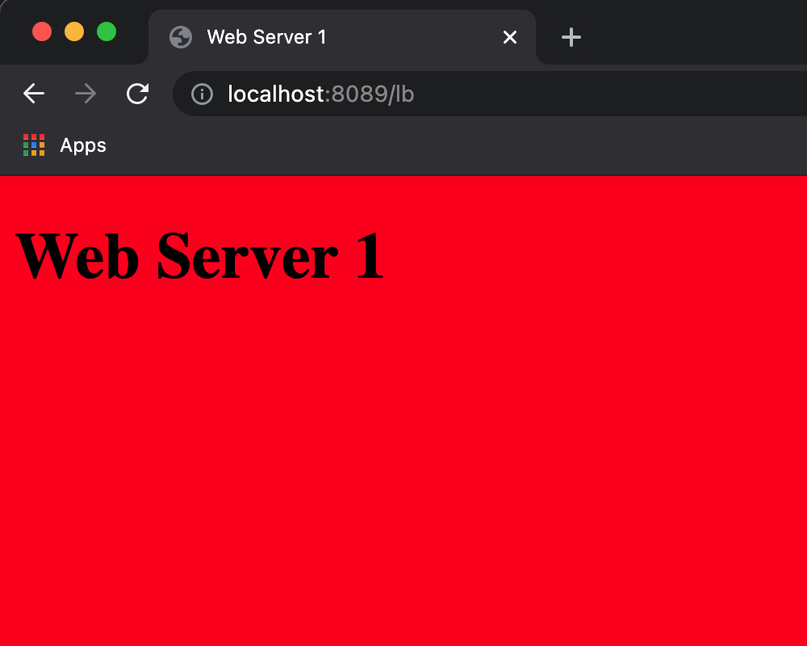
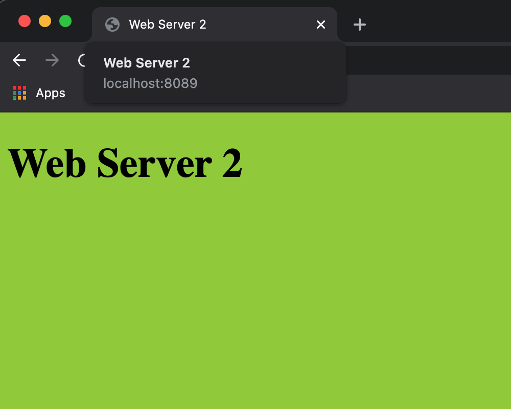

# Load balancer demo

**Objective**: Run a load-balancer on your local host and understand different load-balancing technique.

## Requirements

A running docker engine on your local host.

## Getting started

- Create a docker network named `load-balancer-demo-net`
```sh
docker network create load-balancer-demo-net
```
- Run docker compose
```sh
docker-compose up -d
```
- Visit [localhost:8089/lb](http://localhost:8089/lb) and refresh your page repetitively. You should see one time a red page and another time a green page. This represents your request being proxied to two different web servers, in a Round Robin matter.





> Note: you have 3 nginx servers running:
>  1. the load-balancer on [localhost:8089](http://localhost:8089)
>  1. A web server 1 serving [a red colored index.html](web-server-1/index.html) on [localhost:8090](http://localhost:8090)
>  1. A web server 2 serving [a green colored index.html](web-server-2/index.html) on [localhost:8091](http://localhost:8091)

## Changing load balancer techniques

Let's say we want to enable the [Least Connections](https://www.nginx.com/blog/choosing-nginx-plus-load-balancing-techniques/#least-connections) mode.

- Edit [load balancer's NGINX configuration file (load-balancer/default.conf)](load-balancer/default.conf):
```jinja2
# inside load-balancer/default.conf
server {
    least-conn;

    server web-server-1;
    server web-server-2;
}
# Rest of the file stays the same
```
- Restart your load balancer docker container to make this changes active:
```sh
docker-compose restart load-balancer
```

Now, the next proxy will be to the upstream that had the least connections sofar.

If you wish to try out the [IP Hash](https://www.nginx.com/blog/choosing-nginx-plus-load-balancing-techniques/#ip-hash) mode:

- Edit [load balancer's NGINX configuration file (load-balancer/default.conf)](load-balancer/default.conf):
```jinja2
# inside load-balancer/default.conf
server {
    ip_hash;

    server web-server-1;
    server web-server-2;
}
# Rest of the file stays the same
```
- Restart your load balancer docker container to make this changes active:
```sh
docker-compose restart load-balancer
```

Now, access your [load-balancer page again](http://localhost:8089/lb) and observe that you will always get the same page. Because your IP address is the same, so you'll always get proxy to the same upstream.

> Read more about all four load-balancer techniques: [Choosing NGinx load balancing technique](https://www.nginx.com/blog/choosing-nginx-plus-load-balancing-techniques)

## View load balancer logs

The docker-compose file is mounting load-balancer/log/access.log and load-balancer/log/error.log as volume.

While your nginx is running, you can see error logs or access logs by running:
```sh
# for access logs on localhost:8089 (your load balancer)
tail -f load-balancer/log/access.log
```
and 
```sh
# for error and warning logs on localhost:8089 (your load balancer)
tail -f load-balancer/log/error.log
```
